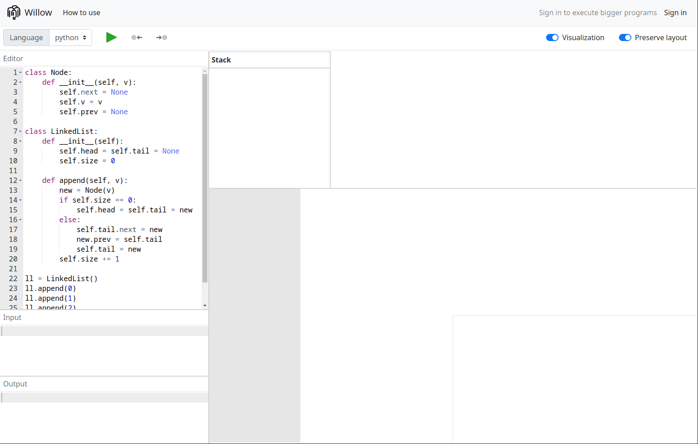

# How to use

### Para instruções em português acesse esse [link](./HOW_TO_USE_PT.md).

## Interface

## Toolbar

The toolbar contains **language** and execution controls. Choose the language you want to use and click **play** to start. The **left and right arrows** are used to step backwards and forwards in the code. You can also use the **keyboard arrows**.

The **Visualization** toggle on the right side enable and disable the visualization panes.
**Preserve Layout** remember manipulations done in a program visualization for the next execution of a program. It is useful when the user runs consecutive, slightly modified versions of the same program.

## Editors

On the left side there are two editors for source code and input, and an output pane.

The **source editor** provides basic syntax highlight and snippets for the chosen language in the toolbar.
During the execution of the program, it also highlights the line to be executed, and show color codes for function calls, returns and exceptions.

The **input editor** is used to feed data to the program through standard input stream (stdin).
If the program consumes all available input, it will not hang waiting for more input, because a EOF flag is also emitted.

The **output pane** shows the standard output (stdout) of the program up to the current execution point, or any errors that might have been thrown.

## Visualization

The visualization components show a representation of the program state.

### Stack

The stack shows the variables of all scopes of the program.
Variables that are references to an object in the heap are displayed with the value (`::`) and the reference is shown as an arrow in the heap with the variable name.
Some objects may be represented as strings.

### Stack Trace

The stack trace shows all functions scopes that were created in the program execution.
The stack trace also shows the current point of the program with a highlight color.
The stack trace scopes can also be used for program navigation.
By clicking on then, the program execution point will jump to the start of the function scope, if double-click, it will jump to the end of the function scope.

### Heap

The heap renders the objects created during the program execution.
Objects are drawn with default shapes depending on their types, but they can be changed through the context menu.

The available shapes are:
-   Array: Displays all elements of arrays and iterables such as linked lists and sets.
-   Columns: Show values a columns, only supports numeric arrays (without Infinity and NaN).
-   Field: Displays a single field of an object.
-   Map: Shows all fields of an object.

Shapes also have extra parameters that change the way they are displayed.

The heap view can be moved and zoomed by dragging and scrolling.

> Note: the components of the visualization are very high level abstractions and do not represent faithfully the elements of the program.
For the sake of the visualization and depending on the language, things that should be represented as objects are not, and builtin elements may be hidden.

#### Positioning

Objects can be moved inside the heap area by dragging them.
Many objects can be moved at once by pressing `ALT` if they are linked.

The effects of the positioning apply from the program step it moved up until the end of the program.

Automatic layout of data structures can be enabled by double clicking any element of the structure.
The base element will present a darker contour, meaning that the data structure auto layout is enabled.
If the base element is moved or deleted, the auto layout is disabled.

